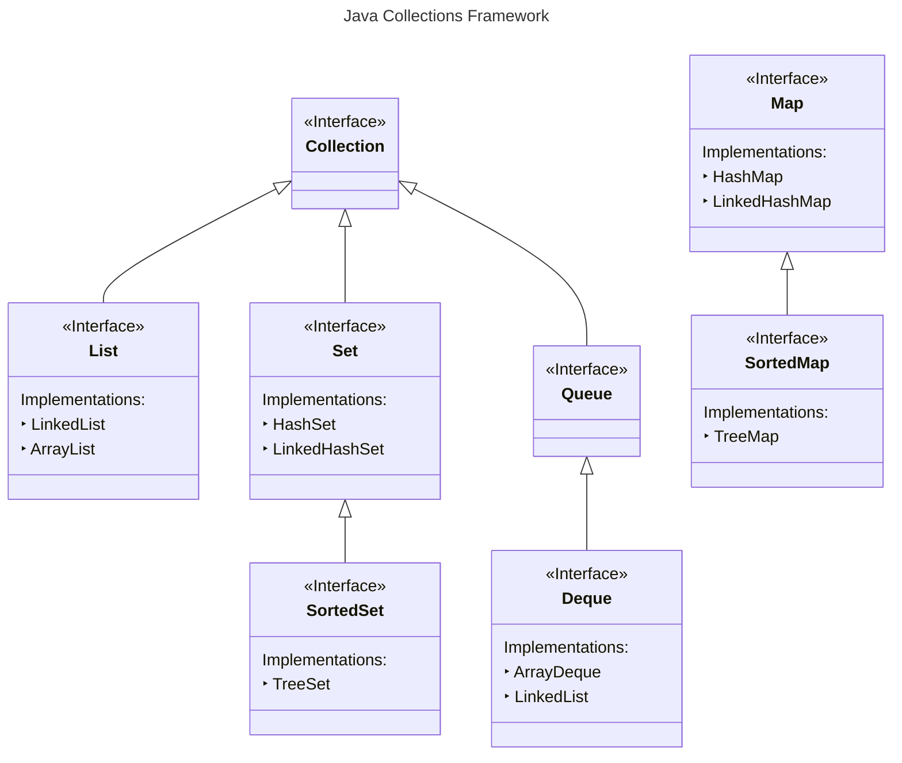
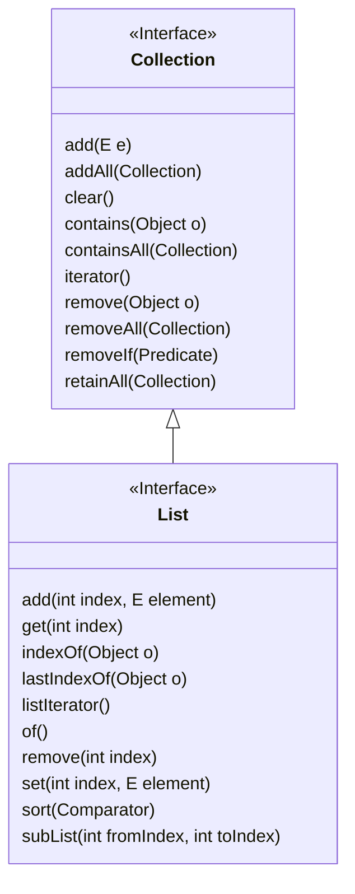
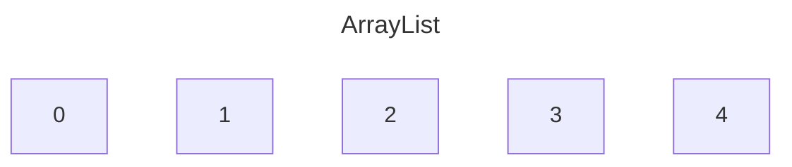
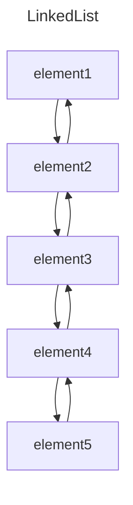
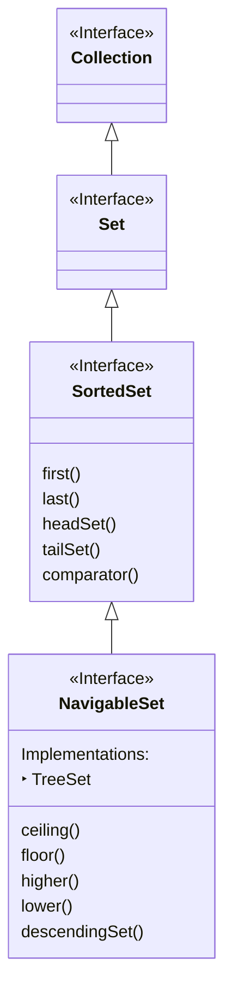

# Notes

## The Big Picture

| __Interfaces__ | __Hash table Implementations__ | __Resizable array Implementations__	 | __Tree Implementations__ | __Linked list Implementations__ | __Hash table + Linked list Implementations__ |
|----------------|--------------------------------|--------------------------------------|--------------------------|---------------------------------|----------------------------------------------|
| `Set`          | `HashSet`                      |                                      | `TreeSet`                |                                 | `LinkedHashSet`                              |
| `List`         |                                | `ArrayList`                          |                          | `LinkedList`                    |                                              |
| `Queue`        |                                |                                      |                          |                                 |                                              |
| `Deque`        |                                | `ArrayDeque`                         |                          | `LinkedList`                    |                                              |
| `Map`          | `HashMap`                      |                                      | `TreeMap`                |                                 | `LinkedHashMap`                              |

## The `Collection` Interface

### `Collection` and `List`

### `List` implementations

* A list can be either indexed, as an ArrayList, or not, like a LinkedList, but a LinkedList is implemented to support all
    of these methods as well
* A List is An ordered collection
* `ArrayList` is sequenced in memory

### `Queue`

* Most often these may be implemented as First In, First Out (FIFO), but can be implemented like a Stack, as Last In First
Out (LIFO)

> [!NOTE] 
> Deque supports both

### `Set`

* A Set is a collection conceptually based off of a mathematical set
* It contains no duplicate elements, and isn't naturally sequenced or ordered
* A Sorted Set is a set that provides a total ordering of the elements

#### `HashSet`, `LinkedHashSet`, `EnumSet`

| Operation    | Time complexity |
|--------------|-----------------|
| `add()`      | `O(1)`*         |
| `remove()`   | `O(1)`          |
| `contains()` | `O(1)`          |

* All of that thanks to the internal `HashMap` implementation
* `O(1)`* - amortized (as in the worst case scenario it will take `O(n)` if the rehashing of all elements is required when
    the `Initial Capacity` is reached)

#### When creating `hashCode()`

1. It should be very fast to compute
2. It should produce a consistent result each time it's called
3. Objects that are considered equal should produce the same hashCode
4. Values used in the calculation should not be mutable

#### `TreeSet`

##### Time complexity

| Operation    | Time complexity |
|--------------|-----------------|
| `add()`      | `O(long(n))`    |
| `remove()`   | `O(long(n))`    |
| `contains()` | `O(long(n))`    |

* The `O(long(n))` time complexity is caused by the Btree structure and the need to traverse the tree and keep it
  balanced

##### Interface hierarchy

* Elements which implement Comparable (said to have a natural order sort, like Strings and numbers) can be elements of a
  TreeSet
* If our elements don't implement Comparable, you must pass a Comparator to the constructor

##### `SortedSet` methods

| sub set methods                                                                                                           | inclusive                                                                                  | description                                                                                                   |
|---------------------------------------------------------------------------------------------------------------------------|--------------------------------------------------------------------------------------------|---------------------------------------------------------------------------------------------------------------|
| `headSet(E toElement)` `headSet(E toElement, boolean inclusive)`                                                      | `toElement` is exclusive if not specified                                                  | returns all elements less than the passed `toElement` (unless `inclusive` is specifically included)           |
| `tailSet(E fromElement)` `tailSet(E toElement, boolean inclusive)`                                                    | `fromElement` is inclusive if not specified                                                | returns all elements greater than or equal to the `fromElement` (unless `inclusive` is specifically included) |
| `subSet(E fromElement, E toElement)` `subSet(E fromElement, boolean fromInclusive, E toElement, boolean toInclusive)` | `fromElement` is inclusive if not specified, `toElement` is exclusive if not specified | returns elements greater than or equal to `fromElement` and less than `toElement`                             |

* All three methods, headSet, tailSet and subSet return a subset of elements, backed by the original set

##### `NavigableSet` methods

|            | `floor(E)`  (<=)       | `lower(E)`  (<)                                   | `ceiling(E)` (>=)	     | `higher(E)`  (>)                                   |
|------------|------------------------|---------------------------------------------------|------------------------|----------------------------------------------------|
| In Set     | Matched Element        | Next Element < Element  or null if none found | Matched Element	       | Next Element > Element or null if none found   |
|
| Not In Set | Next Element < Element | Next Element < Element  or null if none found | Next Element > Element | Next Element > Element   or null if none found |

##### When to use

* If the number of elements is not large, or we want a collection that's sorted, and continuously re-sorted as we add
  and remove elements, and that shouldn't contain duplicate elements, the `TreeSet` is a good alternative to
  the `ArrayList`

## `Map`

* A Map is a collection that stores key and value pairs
* The keys are a set, and the values are a separate collection, where the key keeps a reference to a value
* Keys need to be unique, but values don't
* Elements in a tree are stored in a key value Node, also called an Entry
