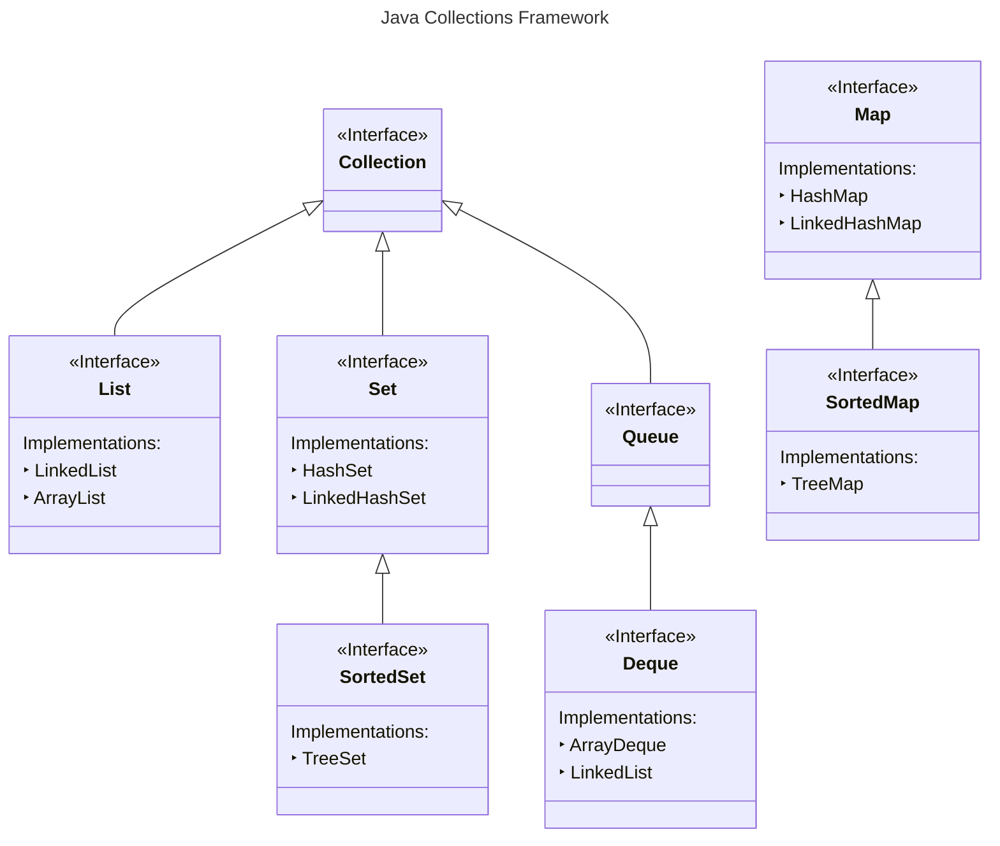

# Notes

## The Big Picture

```mermaid
---
title: Java Collections Framework
---
classDiagram
    class Collection
    class List {
        Implementations:
        ‣ LinkedList
        ‣ ArrayList
    }
    class Set {
        Implementations:
        ‣ HashSet
        ‣ LinkedHashSet
    }
    class Queue
    class SortedSet {
        Implementations:
        ‣ TreeSet
    }
    class Deque {
        Implementations:
        ‣ ArrayDeque
        ‣ LinkedList
    }
    class Map {
        Implementations:
        ‣ HashMap
        ‣ LinkedHashMap
    }
    class SortedMap {
        Implementations:
        ‣ TreeMap
    }
    <<Interface>> Collection
    <<Interface>> List
    <<Interface>> Set
    <<Interface>> Queue
    <<Interface>> SortedSet
    <<Interface>> Deque
    <<Interface>> Map
    <<Interface>> SortedMap
    Collection <|-- List
    Collection <|-- Set
    Collection <|-- Queue
    Set <|-- SortedSet
    Queue <|-- Deque
    Map <|-- SortedMap
```
