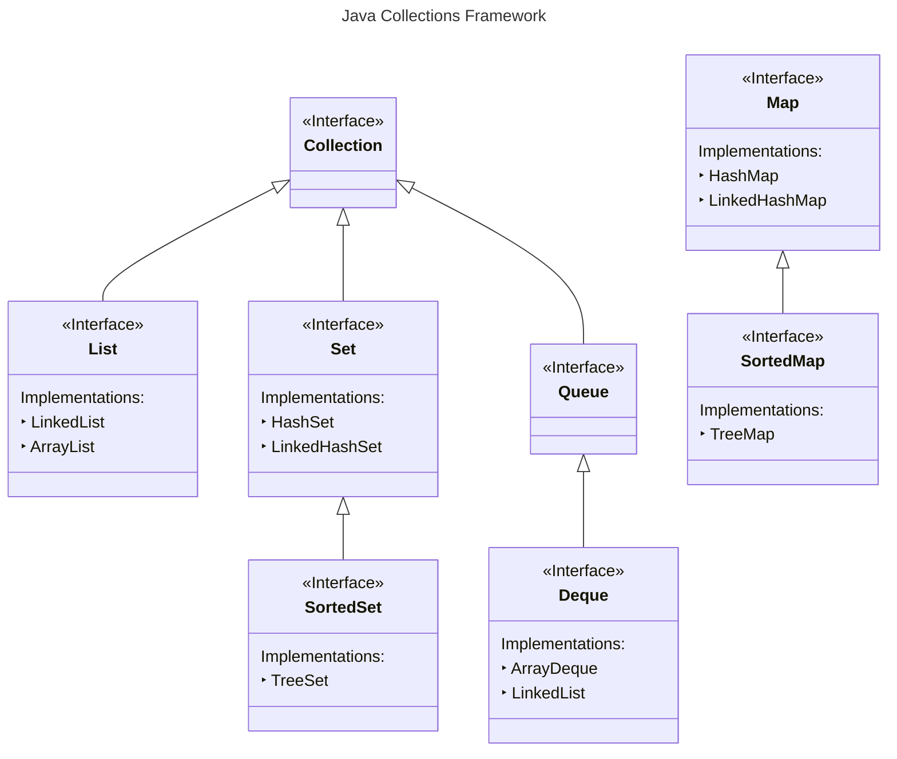
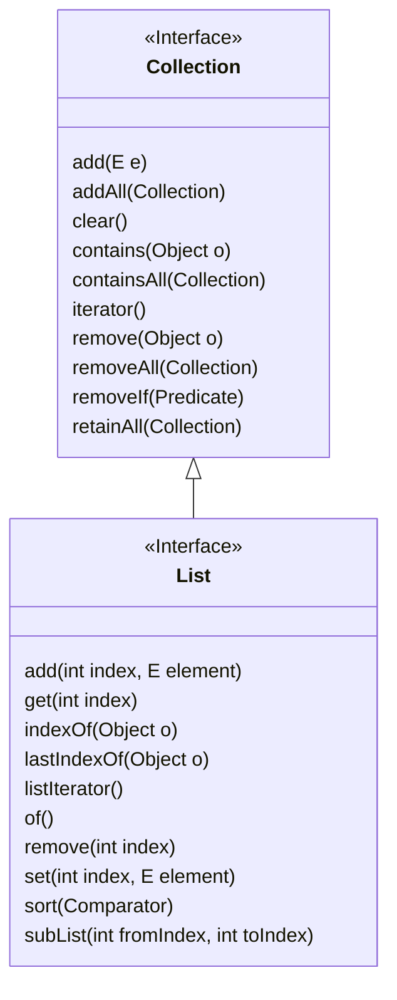
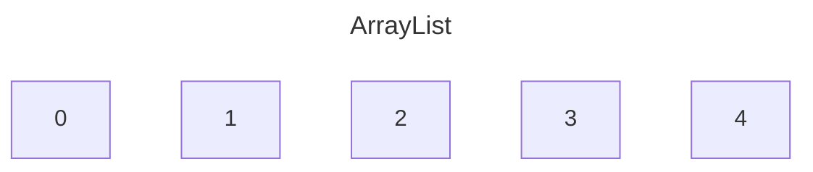
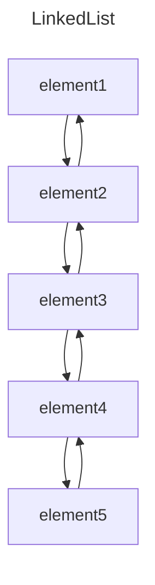

# Notes

## The Big Picture

| __Interfaces__ | __Hash table Implementations__ | __Resizable array Implementations__	 | __Tree Implementations__ | __Linked list Implementations__ | __Hash table + Linked list Implementations__ |
|----------------|--------------------------------|--------------------------------------|--------------------------|---------------------------------|----------------------------------------------|
| `Set`          | `HashSet`                      |                                      | `TreeSet`                |                                 | `LinkedHashSet`                              |
| `List`         |                                | `ArrayList`                          |                          | `LinkedList`                    |                                              |
| `Queue`        |                                |                                      |                          |                                 |                                              |
| `Deque`        |                                | `ArrayDeque`                         |                          | `LinkedList`                    |                                              |
| `Map`          | `HashMap`                      |                                      | `TreeMap`                |                                 | `LinkedHashMap`                              |

## The `Collection` Interface

### `Collection` and `List`

### `List` implementations

* A list can be either indexed, as an ArrayList, or not, like a LinkedList, but a LinkedList is implemented to support all
    of these methods as well
* A List is An ordered collection
* `ArrayList` is sequenced in memory

### `Queue`

* Most often these may be implemented as First In, First Out (FIFO), but can be implemented like a Stack, as Last In First
Out (LIFO)

> [!NOTE] 
> Deque supports both

### `Set`

* A Set is a collection conceptually based off of a mathematical set
* It contains no duplicate elements, and isn't naturally sequenced or ordered
* A Sorted Set is a set that provides a total ordering of the elements

#### `HashSet`, `LinkedHashSet`, `EnumSet`

| Operation    | Time complexity |
|--------------|-----------------|
| `add()`      | `O(1)`          |
| `remove()`   | `O(1)`          |
| `contains()` | `O(1)`          |
|              |                 |

All of that thanks to the internal `HashMap` implementation

#### When creating `hashCode()`

1. It should be very fast to compute
2. It should produce a consistent result each time it's called
3. Objects that are considered equal should produce the same hashCode
4. Values used in the calculation should not be mutable

## `Map`

* A Map is a collection that stores key and value pairs
* The keys are a set, and the values are a separate collection, where the key keeps a reference to a value
* Keys need to be unique, but values don't
* Elements in a tree are stored in a key value Node, also called an Entry
