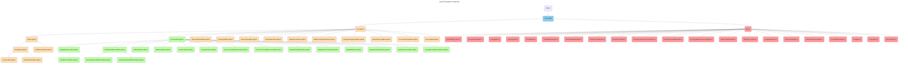

# Notes

## Exceptions

```mermaid
---
title: Java Exceptions Hirarchy
---
graph TD
    0(Object)
    1(Throwable)
    2(Error)
    3(OutOfMemoryError)
    4(StackOverflowError)
    5(LinkageError)
    6(Exception)
    7(IOException)
    8(SocketException)
    9(FileNotFoundException)
    10(RuntimeException)
    11(IllegalArgumentException)
    12(NumberFormatException)
    13(IndexOutOfBoundsException)
    14(ArrayIndexOutOfBoundsException)
    15(ArithmeticException)
    16(NullPointerException)
    17(ClassCastException)
    18(NoSuchMethodException)
    19(InterruptedException)
    20(NoSuchFieldException)
    21(InstantiationException)
    22(IllegalAccessException)
    23(ReflectiveOperationException)
    24(AssertionError)
    25(ThreadDeath)
    26(VirtualMachineError)
    27(BootstrapMethodError)
    28(ClassCircularityError)
    29(ClassFormatError)
    30(UnsupportedClassVersionError)
    31(ExceptionInInitializerError)
    32(IncompatibleClassChangeError)
    33(AbstractMethodError)
    34(IllegalAccessError)
    35(InstantiationError)
    36(NoSuchFieldError)
    37(NoClassDefFoundError)
    38(UnsatisfiedLinkError)
    39(VerifyError)
    40(InternalError)
    41(UnknownError)
    42(CloneNotSupportedException)
    43(ConnectException)
    44(UnknownHostException)
    45(ClassNotFoundException)
    46(InvocationTargetException)
    47(ArrayStoreException)
    48(ConcurrentModificationException)
    49(EnumConstantNotPresentException)
    50(IllegalThreadStateException)
    51(IllegalMonitorStateException)
    52(IllegalStateException)
    53(StringIndexOutOfBoundsException)
    54(NegativeArraySizeException)
    55(SecurityException)
    56(TypeNotPresentException)
    57(UnsupportedOperationException)

    0 --- 1
    1 --- 6
    1 --- 2
    2 --- 3
    2 --- 4
    2 --- 5
    6 --- 7
    7 --- 8
    7 --- 9
    6 --- 10
    10 --- 11
    11 --- 12
    10 --- 13
    13 --- 14
    10 --- 15
    10 --- 16
    10 --- 17
    6 --- 18
    6 --- 19
    6 --- 20
    6 --- 21
    6 --- 22
    6 --- 23
    2 --- 24
    2 --- 25
    2 --- 26
    2 --- 27
    2 --- 28
    2 --- 29
    2 --- 30
    2 --- 31
    2 --- 32
    2 --- 33
    2 --- 34
    2 --- 35
    2 --- 36
    2 --- 37
    2 --- 38
    2 --- 39
    2 --- 40
    2 --- 41
    6 --- 42
    8 --- 43
    8 --- 44
    6 --- 45
    6 --- 46
    10 --- 47
    10 --- 48
    10 --- 49
    10 --- 50
    10 --- 51
    10 --- 52
    13 --- 53
    10 --- 54
    6 --- 55
    10 --- 56
    10 --- 57

    classDef Red fill:#FF9999;
    classDef Amber	fill:#FFDEAD;
    classDef Green fill:#BDFFA4;
    classDef Blue fill:#87CEEB, font-color:#000000;

    class 1 Blue;
    class 2,3,4,5,24,25,26,27,28,29,30,31,32,33,34,35,36,37,38,39,40,41 Red;
    class 10,11,12,13,14,15,16,17,47,48,49,50,51,52,53,54,56,57 Green;
    class 6,7,8,9,18,19,20,21,22,23,42,43,44,45,46,55 Amber;

    linkStyle default fill: none, stroke: grey;
```
