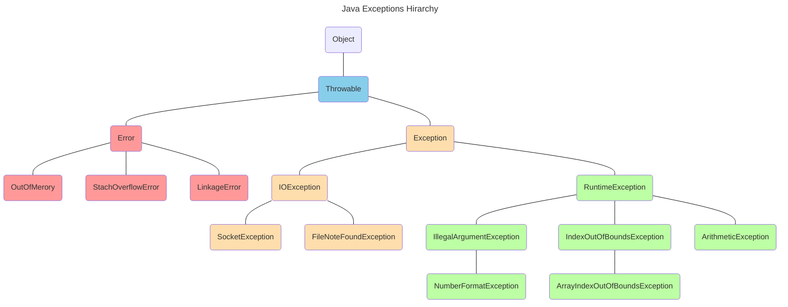

# Notes

## Exceptions

```mermaid
---
title: Java Exceptions Hirarchy
---
graph TD
    0(Object)
    1(Throwable)
    2(Error)
    3(OutOfMerory)
    4(StachOverflowError)
    5(LinkageError)
    6(Exception)
    7(IOException)
    8(SocketException)
    9(FileNoteFoundException)
    10(RuntimeException)
    11(IllegalArgumentException)
    12(NumberFormatException)
    13(IndexOutOfBoundsException)
    14(ArrayIndexOutOfBoundsException)
    15(ArithmeticException)
    
    0 --- 1
    1 --- 6
    1 --- 2
    2 --- 3
    2 --- 4
    2 --- 5
    6 --- 7
    7 --- 8
    7 --- 9
    6 --- 10
    10 --- 11
    11 --- 12
    10 --- 13
    13 --- 14
    10 --- 15
    
    classDef Red fill:#FF9999;
    classDef Amber	fill:#FFDEAD;
    classDef Green fill:#BDFFA4;
    classDef Blue fill:#87CEEB, font-color:#000000;

    class 1 Blue;
    class 2,3,4,5 Red;
    class 10,11,12,13,14,15 Green;
    class 6,7,8,9 Amber;

    linkStyle default fill: none, stroke: black;
```
