# Collections 

## The Big Picture

```mermaid
---
title: Java Collections Framework
---
classDiagram
    class Collection
    class List {
        Implementations:
        ‣ LinkedList
        ‣ ArrayList
    }
    class Set {
        Implementations:
        ‣ HashSet
        ‣ LinkedHashSet
    }
    class Queue
    class SortedSet {
        Implementations:
        ‣ TreeSet
    }
    class Deque {
        Implementations:
        ‣ ArrayDeque
        ‣ LinkedList
    }
    class Map {
        Implementations:
        ‣ HashMap
        ‣ LinkedHashMap
    }
    class SortedMap {
        Implementations:
        ‣ TreeMap
    }
    <<Interface>> Collection
    <<Interface>> List
    <<Interface>> Set
    <<Interface>> Queue
    <<Interface>> SortedSet
    <<Interface>> Deque
    <<Interface>> Map
    <<Interface>> SortedMap
    Collection <|-- List
    Collection <|-- Set
    Collection <|-- Queue
    Set <|-- SortedSet
    Queue <|-- Deque
    Map <|-- SortedMap
```

| __Interfaces__ | __Hash table Implementations__ | __Resizable array Implementations__	 | __Tree Implementations__ | __Linked list Implementations__ | __Hash table + Linked list Implementations__ |
|----------------|--------------------------------|--------------------------------------|--------------------------|---------------------------------|----------------------------------------------|
| `Set`          | `HashSet`                      |                                      | `TreeSet`                |                                 | `LinkedHashSet`                              |
| `List`         |                                | `ArrayList`                          |                          | `LinkedList`                    |                                              |
| `Queue`        |                                |                                      |                          |                                 |                                              |
| `Deque`        |                                | `ArrayDeque`                         |                          | `LinkedList`                    |                                              |
| `Map`          | `HashMap`                      |                                      | `TreeMap`                |                                 | `LinkedHashMap`                              |

## The `Collection` Interface

### `Collection` and `List`

### `List` implementations

* A list can be either indexed, as an ArrayList, or not, like a LinkedList, but a LinkedList is implemented to support all
    of these methods as well
* A List is An ordered collection
* `ArrayList` is sequenced in memory

### `Queue`

* Most often these may be implemented as First In, First Out (FIFO), but can be implemented like a Stack, as Last In First
Out (LIFO)

:::note
Deque supports both
:::

### `Set`

* A Set is a collection conceptually based off of a mathematical set
* It contains no duplicate elements, and isn't naturally sequenced or ordered
* A Sorted Set is a set that provides a total ordering of the elements

#### `HashSet`, `LinkedHashSet`, `EnumSet`

| Operation    | Time complexity |
|--------------|-----------------|
| `add()`      | `O(1)`*         |
| `remove()`   | `O(1)`          |
| `contains()` | `O(1)`          |

* All of that thanks to the internal `HashMap` implementation
* `O(1)`* - amortized (as in the worst case scenario it will take `O(n)` if the rehashing of all elements is required when
    the `Initial Capacity` is reached)

#### When creating `hashCode()`

1. It should be very fast to compute
2. It should produce a consistent result each time it's called
3. Objects that are considered equal should produce the same hashCode
4. Values used in the calculation should not be mutable

#### `TreeSet`

##### Time complexity

| Operation    | Time complexity |
|--------------|-----------------|
| `add()`      | `O(long(n))`    |
| `remove()`   | `O(long(n))`    |
| `contains()` | `O(long(n))`    |

* The `O(long(n))` time complexity is caused by the Btree structure and the need to traverse the tree and keep it
  balanced

##### Interface hierarchy

```mermaid
classDiagram
    class Collection
    class Set
    class SortedSet {
        first()
        last()
        headSet()
        tailSet()
        comparator()
    }
    class NavigableSet {
        ceiling()
        floor()
        higher()
        lower()
        descendingSet()
        
        Implementations:
        ‣ TreeSet
    }
    <<Interface>> Collection
    <<Interface>> Set
    <<Interface>> SortedSet
    <<Interface>> NavigableSet
    Collection <|-- Set
    Set <|-- SortedSet
    SortedSet <|-- NavigableSet
```

* Elements which implement Comparable (said to have a natural order sort, like Strings and numbers) can be elements of a
  TreeSet
* If our elements don't implement Comparable, you must pass a Comparator to the constructor

##### `SortedSet` methods

| sub set methods                                                                                                           | inclusive                                                                                  | description                                                                                                   |
|---------------------------------------------------------------------------------------------------------------------------|--------------------------------------------------------------------------------------------|---------------------------------------------------------------------------------------------------------------|
| `headSet(E toElement)` `headSet(E toElement, boolean inclusive)`                                                      | `toElement` is exclusive if not specified                                                  | returns all elements less than the passed `toElement` (unless `inclusive` is specifically included)           |
| `tailSet(E fromElement)` `tailSet(E toElement, boolean inclusive)`                                                    | `fromElement` is inclusive if not specified                                                | returns all elements greater than or equal to the `fromElement` (unless `inclusive` is specifically included) |
| `subSet(E fromElement, E toElement)` `subSet(E fromElement, boolean fromInclusive, E toElement, boolean toInclusive)` | `fromElement` is inclusive if not specified, `toElement` is exclusive if not specified | returns elements greater than or equal to `fromElement` and less than `toElement`                             |

* All three methods, headSet, tailSet and subSet return a subset of elements, backed by the original set

##### `NavigableSet` methods

|------------|------------------------|---------------------------------------------------|------------------------|----------------------------------------------------|
| In Set     | Matched Element        | Next Element < Element  or null if none found | Matched Element	       | Next Element > Element or null if none found   |
|
| Not In Set | Next Element < Element | Next Element < Element  or null if none found | Next Element > Element | Next Element > Element   or null if none found |

##### When to use

* If the number of elements is not large, or we want a collection that's sorted, and continuously re-sorted as we add
  and remove elements, and that shouldn't contain duplicate elements, the `TreeSet` is a good alternative to
  the `ArrayList`

## [`Map`](https://www.baeldung.com/java-hashmap-advanced)

* A Map is a collection that stores key and value pairs
* The keys are a set, and the values are a separate collection, where the key keeps a reference to a value
* Keys need to be unique, but values don't
* Elements in a tree are stored in a key value Node, also called an Entry

### Implementation

* The set returned from the `keySet` method, is backed by the map
* This means changes to the map are reflected in the set, and vice-versa
* The set supports element removal, which removes the corresponding mapping from the map
* You can use the methods `remove`, `removeAll`, `retainAll`, and `clear`
* It does not support the `add` or `addAll` operations

### `HashMap`, `LinkedHashMap`

* The `HashMap` maintains an array of `Nodes`, in a field called `table`, whose size is managed by Java, and whose
  indices are determined by hashing functions
* The LinkedHashMap is a key value entry collection, whose keys are ordered by insertion order

| Operation    | Time complexity |
|--------------|-----------------|
| `add()`      | `O(1)`*         |
| `remove()`   | `O(1)`          |
| `contains()` | `O(1)`          |

### `TreeMap`

* `TreeMap` is a map implementation that keeps its entries sorted according to the natural ordering of its keys or better
  still using a comparator if provided by the user at construction time
* `TreeMap` implements `NavigableMap` interface and bases its internal working on the principles of red-black trees

| Operation    | Time complexity |
|--------------|-----------------|
| `add()`      | `O(long(n))`    |
| `remove()`   | `O(long(n))`    |
| `contains()` | `O(long(n))`    |

#### `TreeMap`'s View collections

| View collection methods                                                                                                  | Notes                                                                                                                                                                                                                                                          |
|--------------------------------------------------------------------------------------------------------------------------|----------------------------------------------------------------------------------------------------------------------------------------------------------------------------------------------------------------------------------------------------------------|
| `entrySet()`, `keySet()`, `values()`                                                                                     | Provides views of mappings, keys and values. These are views available to any map, and not just the `TreeMap`.                                                                                                                                                 |
| `descendingKeySet()`, `descendingKeyMap()`                                                                               | Provides reversed order key set or map, reversed by the key values                                                                                                                                                                                             |
| `headMap(K key)`, `headMap(K key, boolean inclusive)`, `tailMap(K key)`, `tailMap(K key, boolean inclusive)` | Provides views of either the first or last parts of the map, divided by the key passed The head map is by default EXCLUSIVE of all elements higher or equal to the key The tail map is by default INCLUSIVE of all elements higher or equal to the key |
| `subMap(K fromKey, K toKey)`, `subMap(K fromKey, boolean inclusive, K toKey, boolean inclusive)`                     | Provides a view of a contiguous section of the map, higher or equal to the `fromKey` and lower than the `toKey`, so the toKey is EXCLUSIVE The overloaded version allows you to determine the inclusivity you want for both keys                           |

#### `EnumSet` and `EnumMap`

##### `EnumSet`

* The `EnumSet` is a specialized Set implementation for use with enum values
* All the elements in an EnumSet must come from a single enum type
* The `EnumSet` is abstract, meaning we can't instantiate it directly
* It comes with many factory methods to create instances
* In general, this set has much better performance than using a HashSet, with an enum type
* Bulk operations (such as `containsAll` and `retainAll`) should run very quickly, in constant time, `O(1)`, if they're run
  on an `enumSet`, and their argument is an EnumSet

##### Two Types of `EnumSet` implementations

* Enum sets are represented internally as bit vectors, which is just a series of ones and zeros
* A one indicates that the enum constant (with an ordinal value that is equal to the index of the bit) is in the set
* A zero indicates the enum constant is not in the set
* Using a bit vector allows all set operations to use bit math, which makes it very fast
* A `RegularEnumSet` uses a single long as its bit vector, which means it can contain a maximum of 64 bits, representing
  64 enum values
* A `JumboEnumSet` gets returned if you have more than 64 enums

##### `EnumMap`

* The Enum Map is a specialized Map implementation for use with enum type keys
* The keys must all come from the same enum type, and they're ordered naturally by the ordinal value of the enum
  constants
* This map has the same functionality as a HashMap, with `O(1)` for basic operations
* The enum key type is specified during construction of the EnumMap, either explicitly by passing the key type's class,
  or implicitly by passing another EnumSet
* In general, this map has better performance than using a HashMap, with an enum type
