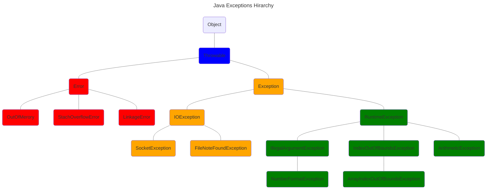
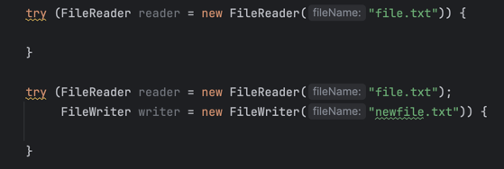
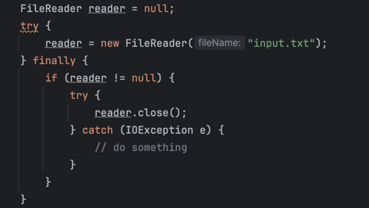

# IO

## Exceptions

* The `Error` class indicates serious problems, that a reasonable application shouldn't try to catch or recover from
* There are two types of Exceptions, those that subclass from `RuntimeException`, and those that don't

### Checked Exception

A checked exception represents an anticipated or common problem, that might occur

We have two ways to handle checked exceptions:

* We can wrap the statement that throws a checked exception, in a `try` `catch` block, and then handle the situation in the
  catch block
* We can change the method signature, declaring a `throws` clause, and specifying this exception type

#### LBYL and EAFP

* "Look Before You Leap" or LBYL - style of coding involves checking for errors, before you perform an operation
* EAFP stands for, "Easier to Ask Forgiveness than Permission" assumes an operation will usually succeed, and then
handles any errors that occur, if they do occur

| Feature       | LBYL                                            | EAFP                                                                    |
|---------------|-------------------------------------------------|-------------------------------------------------------------------------|
| Approach      | Check for errors before performing an operation | Assume that the operation will succeed and handle any errors that occur |
| Advantages    | Can be more efficient if errors are rare        | Can be more concise and easier to read                                  |
| Disadvantages | Can be more verbose if errors are common        | Can be more difficult to debug if errors are unexpected                 |

### Unchecked Exception

* A checked exception means it's NOT an unchecked exception :)
* An Unchecked Exception is an instance of a RuntimeException, or one if its subclasses

### `finally`

The original purpose for the `finally` clause, was to have a single block of code to perform cleanup operations

* Is used in conjunction with a `try` statement
* A traditional try statement requires either a `catch` or a `finally` clause, or can include both
* It is always declared after the catch block if one is declared
* Its code is always executed, regardless of what happens in the try or catch blocks
* Does not have access to either the try or catch block's local variables

Disadvantages:

* It can be difficult to read and understand code, that uses this clause
* It can be used to hide errors, which can make debugging more difficult
* If We execute code that's not related to clean up tasks, this will make it harder to maintain our code

### Try-with-resources

| try-with-resources  examples                                     | traditional try clause                                    |
|------------------------------------------------------------------|-----------------------------------------------------------|
|  |  |

* The try-with-resources takes a colon delimited list of resource variables
* The resources in this list must implement the `AutoCloseable` or the `Closeable` interface
* The try-with-resources statement can be used without a `fnally` block, because all resources are automatically closed
  when this type of try block completes, or if it gets an exception
