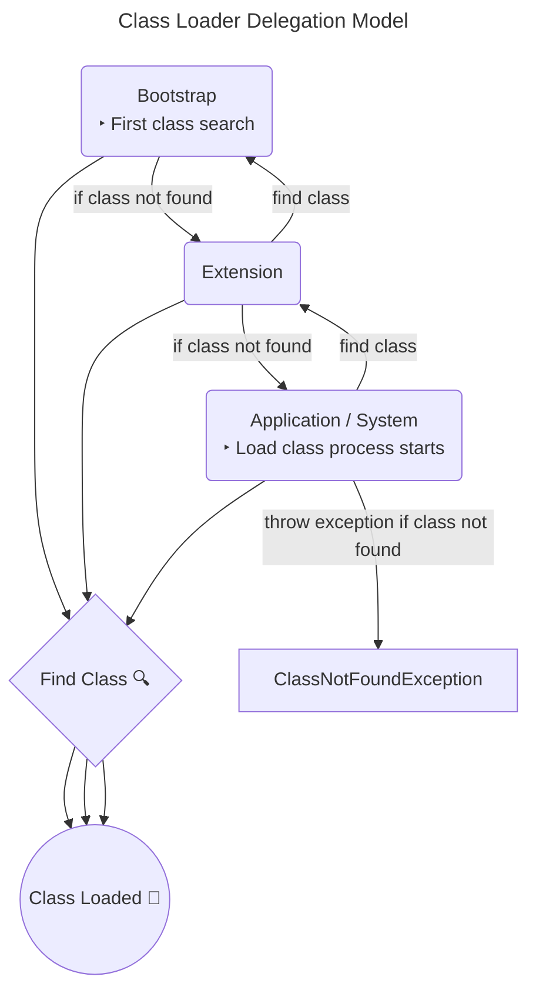

# Things to know about development and Java

<!-- TOC -->
* [Things to know about development and Java](#things-to-know-about-development-and-java)
  * [OOP](#oop)
    * [Polymorphism](#polymorphism)
      * [Parametric](#parametric)
      * [Ad hock](#ad-hock)
    * [Inheritance](#inheritance)
    * [Encapsulation](#encapsulation)
    * [Abstraction](#abstraction)
  * [SOLID](#solid)
    * [S — Single Responsibility](#s--single-responsibility)
    * [O — Open-Closed](#o--open-closed)
    * [L — Liskov Substitution](#l--liskov-substitution)
    * [I — Interface Segregation](#i--interface-segregation)
    * [D — Dependency Inversion](#d--dependency-inversion)
  * [ACID](#acid)
    * [Atomicity](#atomicity)
    * [Consistency](#consistency)
    * [Isolation](#isolation)
    * [Durability](#durability)
  * [KISS](#kiss)
  * [DRY](#dry)
  * [YAGNI](#yagni)
  * [Java](#java)
    * [JDK](#jdk)
    * [JRE](#jre)
    * [JVM](#jvm)
    * [Java Bytecode](#java-bytecode)
    * [`Javac`](#javac)
  * [JVM](#jvm-1)
    * [Class Loaders](#class-loaders)
    * [Classpath](#classpath)
    * [Memory areas](#memory-areas)
<!-- TOC -->

## OOP

Programming paradigm based on the concept of objects, which can contain data and code: data in the form of
fields (often known as attributes or properties), and code in the form of procedures (often known as methods)

### Polymorphism

One interface, multiple implementations

#### Parametric

In Java, it is implemented using inheritance. The child class inherits the method signatures of the parent class, but
the implementation of these methods can be different to suit the specifics of the child class. This is called method
overriding. Other functions can operate on the parent class object, but one of the child classes will be substituted for
it at runtime - late binding

#### Ad hock

When methods with the same signature take different parameters as input. This is called method
overloading

### Inheritance

An abstract data type can inherit the data and functionality of some existing type, facilitating the reuse of software
components

### Encapsulation

Hiding the internal implementation of the class and separating it from the external user interface

### Abstraction

Highlighting significant information and excluding insignificant information from consideration. OOP considers only data
abstraction, implying a set of the most significant characteristics of an object that are available to the rest of the
program

## SOLID

[The S.O.L.I.D Principles in Pictures](https://medium.com/backticks-tildes/the-s-o-l-i-d-principles-in-pictures-b34ce2f1e898)

### S — Single Responsibility

`A class should have a single responsibility`

If a Class has many responsibilities, it increases the possibility of bugs because making changes to one of its
responsibilities, could affect the other ones without you knowing

### O — Open-Closed

`Classes should be open for extension, but closed for modification`

Changing the current behaviour of a Class will affect all the systems using that Class. If you want the Class to perform
more functions, the ideal approach is to add to the functions that already exist NOT change them

### L — Liskov Substitution

`If S is a subtype of T, then objects of type T in a program may be replaced with objects of type S without altering
any of the desirable properties of that program`

The child Class should be able to process the same requests and deliver the same result as the parent Class or it could
deliver a result that is of the same type

### I — Interface Segregation

`Clients should not be forced to depend on methods that they do not use`

This principle aims at splitting a set of actions into smaller sets so that a Class executes ONLY the set of actions it
requires

### D — Dependency Inversion

`High-level modules should not depend on low-level modules. Both should depend on the abstraction`

`Abstractions should not depend on details. Details should depend on abstractions`

This principle says a Class should not be fused with the tool it uses to execute an action. Rather, it should be fused
to the interface that will allow the tool to connect to the Class

It also says that both the Class and the interface should not know how the tool works. However, the tool needs to meet
the specification of the interface

## ACID

[ACID Database Properties](https://intuting.medium.com/acid-database-properties-6bc2b049ed2d)

### Atomicity

All operations in a transaction succeed or every operation is rolled back

### Consistency

On the completion of a transaction, the database is structurally sound

### Isolation

Transactions do not contend with one another. Contentious access to data is moderated by the database so that
transactions appear to run sequentially

### Durability

The results of applying a transaction are permanent, even in the presence of failures

## KISS

[KISS and DRY Principles in Software Engineering](https://medium.com/@susithapb/kiss-and-dry-principles-in-software-engineering-3aee36e72879#1376)

Keep It Simple, Stupid: This principle advocates for simplicity in design. It suggests that systems should be
kept as simple as possible, avoiding unnecessary complexity

## DRY

[KISS and DRY Principles in Software Engineering](https://medium.com/@susithapb/kiss-and-dry-principles-in-software-engineering-3aee36e72879#b953)

Don't Repeat Yourself: DRY principle states that every piece of knowledge or logic should have a single,
unambiguous representation within a system. It encourages code reuse and helps in maintaining consistency

## YAGNI

[The Principles of Clean Code: DRY, KISS, and YAGNI](https://medium.com/@curiousraj/the-principles-of-clean-code-dry-kiss-and-yagni-f973aa95fc4d#c66a)

You Ain't Gonna Need It: YAGNI advises against adding functionality until it's actually needed. It discourages
developers from implementing features based on speculative future requirements

## Java

[Difference between JDK, JRE, and JVM](https://www.javatpoint.com/difference-between-jdk-jre-and-jvm)

Java is a high-level, class-based, object-oriented programming language that is designed to have as few implementation
dependencies as possible. It is a general-purpose programming language intended to let programmers write once, run
anywhere (WORA), meaning that compiled Java code can run on all platforms that support Java without the need to
recompile

### JDK

Java Development Kit is a free Java application development kit distributed by Oracle Corporation,
including the Java compiler (`javac`), standard Java class libraries, examples, documentation, various
utilities and the Java runtime system (JRE)

### JRE

Java Runtime Environment - minimal (without compiler and other tools development) implementation of the virtual machine
required for execution of Java applications. Consists of virtual Java Virtual Machine and Java class libraries. The JRE
is freely
available for most platforms can be downloaded from the Oracle website. The development tools, along with the JRE, are
included in the JDK

### JVM

Java Virtual Machine the main part of the Java runtime system, the so-called Java Runtime Environment (JRE). The Java
Virtual Machine executes Java bytecode that is pre-generated from the source text of a Java program by the Java
compiler (`javac`). The JVM can also be used to run programs written in other programming languages. For example, Ada
source code can be compiled into Java bytecode, which can then be executed by the JVM. The JVM is a key component of the
Java platform. Because Java virtual machines are available for many hardware and software platforms, Java can be
considered both middleware and a platform in its own right. Using a single bytecode across multiple platforms allows
Java to be described as “compile once, run everywhere”

Java virtual machines typically include a bytecode interpreter, but many machines also use JIT compilation of frequently
executed bytecode fragments into machine code to improve performance

Programs intended to run on the JVM must be compiled in a standardized portable binary format, which is typically
represented as `.class` files. A program can consist of many classes located in different files. To make it easier to
host large programs, some `.class` files can be packaged together in what is called a `.jar` file (short for Java
Archive).
The JVM virtual machine executes `.class` and `.jar` files, emulating the instructions given in them in the following
ways:

* Interpretation
* Using a JIT compiler

<div align="center">
  
</div>

### Java Bytecode

Java bytecode is a set of instructions executed by the Java virtual machine. In most cases, Java bytecode is generated
for execution on the Java virtual machine from Java source code. The only original compiler that converts Java code into
Java bytecode is `Javac`, created by Sun Microsystems

### `Javac`

`Javac` is an optimizing compiler for the Java language, included in many Java Development Kits (JDKs). The compiler
accepts source code that conforms to the Java language specification (JLS) and returns bytecode that conforms to the
Java Virtual Machine Specification (JVMS). Javac is written in Java. Can be called directly from java programs (JSR 199)

[Compilation Overview](https://openjdk.org/groups/compiler/doc/compilation-overview/index.html)

The execution of `Javac` is divided into the following phases:

1. All the source files specified on the command line are read, parsed into syntax trees, and then all externally
   visible definitions are entered into the compiler's symbol tables
2. All appropriate annotation processors are called. If any annotation processors generate any new source or class
   files, the compilation is restarted, until no new files are created
3. Finally, the syntax trees created by the parser are analyzed and translated into class files. During the course of
   the analysis, references to additional classes may be found. The compiler will check the source and class path for 
   these classes; if they are found on the source path, those files will be compiled as well, although they will not be
   subject to annotation processing

<div align="center">
  
</div>

## JVM

[JVM (Java Virtual Machine) Architecture](https://www.javatpoint.com/jvm-java-virtual-machine)

The Java Virtual Machine consists of three separate components:

* Class Loaders
* Memory Areas
* Execution Mechanism

<div align="center">
  
</div>

### Class Loaders

[How ClassLoader Works in Java?](https://javarevisited.blogspot.com/2012/12/how-classloader-works-in-java.html#axzz8SMPkf7kW)

Class loader is used to supply the JVM with compiled bytecode, which is typically stored in files with the `.class`
extension, but can also be obtained from other sources, for example, downloaded over the network or generated by the
application itself

Java implements lazy (or lazy) loading of classes. This means that the loading of classes of reference
fields of the loaded class will not be performed until an explicit reference to them is encountered in the application.
In other words, resolving symbolic links is optional and does not occur by default. However, the JVM implementation can
also use energetic loading of classes, i.e. all symbolic links must be taken into account immediately

There are three standard loaders in Java, each of which loads a class from a specific location:

1. `Bootstrap` is a basic loader, also called Primordial ClassLoader. loads standard JDK classes from the `rt.jar`
   archive
2. `Extension` ClassLoader – extension loader. loads extension classes, which are located in the `jre/lib/ext` directory
   by default, but can be set by the `java.ext.dirs` system property
3. `Application / System` ClassLoader – system loader. loads the application classes defined in the `CLASSPATH`
   environment variable

If the desired class has not been loaded before, according to the principle of delegation, control is transferred to the
parent loader, which is located one level higher in the hierarchy. The parent loader also tries to find the desired
class in its cache. If a class has already been loaded and the loader knows its location, then the Class object of that
class will be returned. If not, the search will continue until it reaches the base `Bootstrap`. If the base loader does
not have information about the required class (i.e. it has not yet been loaded), the bytecode of this class will be
searched according to the location of classes that the loader knows about, and if the class cannot be loaded, control
will return back to the downloader, which will try to download from sources known to it. As mentioned above, the
location of classes for the `Bootstrap` loader is the `rt.jar` library, for the `Extension` loader - the directory
with extensions - `jre/lib/ext`, for the `Application / System` one - `CLASSPATH`, for the user one it can be something
different



The class loader subsystem is responsible for more than just searching and importing binary class data. It also checks
the validity of imported classes, allocates and initializes memory for class variables, and helps resolve symbolic
links. These steps are performed in the following order:

1. Loading — searching and importing binary data for a type by its name, creating a class or interface from this binary
   representation

2. Linking — performing verification, preparation and optional permission:
    * Verification — checking the correctness of the imported type
    * Preparation — allocating memory for static class variables and initializing memory to default values
    * Resolution — converting symbolic link types into direct links

3. Initialization — calling to Java code that initializes class variables to their correct initial values

The standard way to load a class with a loader different from the current one is a special version of the static
`Class.forName` method:

```java
    public static Class forName(String name, boolean initialize, ClassLoader loader);
```

If the `initialize` value is `true`, then initialization occurs immediately, otherwise it is delayed until the first call to
any constructor, static method or field of this class

By using separate ClassLoader you can also load the same class from multiple sources, and they will be treated as
different classes in JVM. J2EE uses multiple class loaders to load a class from a different location like classes
from the WAR file will be loaded by Web-app ClassLoader while classes bundled in EJB-JAR are loaded by another
classloader

### Classpath

It specifies a list of directories, JAR files, and ZIP files where the JVM should  look to find and load class files

In addition to Java applications directly (java command), this parameter is also applicable to other JDK utilities, such
as javac, javadoc and others

There are two main ways to set classpath: in the OS environment variable CLASSPATH, and in the command line argument
`-cp` (synonymous with `-classpath`). The second method is preferable because it allows you to set different values for
different applications. Default value is the current directory

The parameter passes the paths to jar files and root directories with packages. Paths are separated by the symbol `:` in
the command line parameter, or `;` in the environment variable. To include all files in a directory, you can use the `*`
symbol at the end of the path

If the application is launched from a jar file (java -jar), the classpath must be specified in its manifest. Inside the
archive, a line like Main-Class is added to the META-INF/MANIFEST.MF file: com.studies.MyClass

### Memory areas

* The class area is designed to store data from .class files: for example, metadata, field and method data, and method
code. Class area is created automatically when the virtual machine starts, and there is only one class area per VM
* Heap. The heap stores all objects and their corresponding instance variables. When we create a new instance of
a class, it is immediately loaded into the heap area, which remains singular while the task is running.
* Stack. All local variables, method calls and partial results are loaded into it
* PC register. The PC register stores the addresses of the Java virtual machines currently performing the operation. In
Java, each thread gets its own PC register
* Native methods stack. Native methods are methods written in C or C++. The JVM stores stacks that support such
methods, with a separate native method stack dedicated to each thread.

### Garbage Collection

[Garbage Collection in Java](https://www.javatpoint.com/how-garbage-collection-works-in-java)

### Execution Mechanism

Interpretation is the process of reading and executing the source code. It is implemented by a program - an interpreter.
This type of software is used for testing hardware and software. However, it does not store any information about the
product being tested

Its parts are:

* Interpreter
* JIT compiler
* Garbage collector

Before executing the program, the interpreter and JIT (Just-in-time) compiler convert the bytecode into machine
instructions. The interpreter does this line by line

At that moment, when a script detects repeating code, a JIT compiler is connected to it to speed up the operation. It
then compiles the bytecode and replaces it with its own bytecode. This process improves the performance of the entire
system.

But what is the responsibility of the garbage collector in this case? In some other programming languages (such as C++),
freeing memory from objects without circular references depends only on the programmer himself. However, in the JVM,
this is done by the garbage collector, which optimizes memory usage

It is important to note that garbage collection is performed automatically in the JVM after certain periods of time and
does not require special attention from specialists. Of course, you can try to force this process by calling
`System.gc()`, but there is no guarantee that this will work
