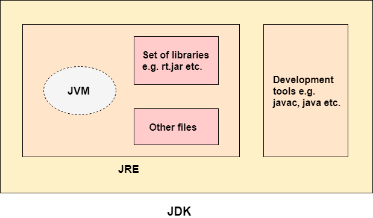
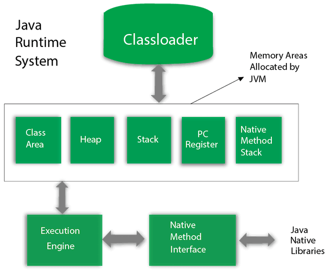

# Things to know about development and Java

<!-- TOC -->
* [Things to know about development and Java](#things-to-know-about-development-and-java)
  * [OOP](#oop)
    * [Polymorphism](#polymorphism)
      * [Parametric](#parametric)
      * [Ad hock](#ad-hock)
    * [Inheritance](#inheritance)
    * [Encapsulation](#encapsulation)
    * [Abstraction](#abstraction)
  * [SOLID](#solid)
    * [S — Single Responsibility](#s--single-responsibility)
    * [O — Open-Closed](#o--open-closed)
    * [L — Liskov Substitution](#l--liskov-substitution)
    * [I — Interface Segregation](#i--interface-segregation)
    * [D — Dependency Inversion](#d--dependency-inversion)
  * [ACID](#acid)
    * [Atomicity](#atomicity)
    * [Consistency](#consistency)
    * [Isolation](#isolation)
    * [Durability](#durability)
  * [KISS](#kiss)
  * [DRY](#dry)
  * [YAGNI](#yagni)
  * [Java](#java)
    * [JDK](#jdk)
    * [JRE](#jre-)
    * [JVM](#jvm-)
  * [JVM](#jvm)
    * [Class Loaders](#class-loaders)
<!-- TOC -->

## OOP

Programming paradigm based on the concept of objects, which can contain data and code: data in the form of
fields (often known as attributes or properties), and code in the form of procedures (often known as methods)

### Polymorphism

One interface, multiple implementations

#### Parametric

In Java, it is implemented using inheritance. The child class inherits the method signatures of the parent class, but the
implementation of these methods can be different to suit the specifics of the child class. This is called method
overriding. Other functions can operate on the parent class object, but one of the child classes will be substituted for
it at runtime - late binding

#### Ad hock

When methods with the same signature take different parameters as input. This is called method
overloading

### Inheritance

An abstract data type can inherit the data and functionality of some existing type, facilitating the reuse of software
components

### Encapsulation

Hiding the internal implementation of the class and separating it from the external user interface

### Abstraction

Highlighting significant information and excluding insignificant information from consideration. OOP considers only data
abstraction, implying a set of the most significant characteristics of an object that are available to the rest of the
program

## SOLID

[The S.O.L.I.D Principles in Pictures](https://medium.com/backticks-tildes/the-s-o-l-i-d-principles-in-pictures-b34ce2f1e898)

### S — Single Responsibility

`A class should have a single responsibility`

If a Class has many responsibilities, it increases the possibility of bugs because making changes to one of its
responsibilities, could affect the other ones without you knowing

### O — Open-Closed

`Classes should be open for extension, but closed for modification`

Changing the current behaviour of a Class will affect all the systems using that Class. If you want the Class to perform
more functions, the ideal approach is to add to the functions that already exist NOT change them

### L — Liskov Substitution

`If S is a subtype of T, then objects of type T in a program may be replaced with objects of type S without altering
any of the desirable properties of that program`

The child Class should be able to process the same requests and deliver the same result as the parent Class or it could
deliver a result that is of the same type

### I — Interface Segregation

`Clients should not be forced to depend on methods that they do not use`

This principle aims at splitting a set of actions into smaller sets so that a Class executes ONLY the set of actions it
requires

### D — Dependency Inversion

`High-level modules should not depend on low-level modules. Both should depend on the abstraction`

`Abstractions should not depend on details. Details should depend on abstractions`

This principle says a Class should not be fused with the tool it uses to execute an action. Rather, it should be fused
to the interface that will allow the tool to connect to the Class

It also says that both the Class and the interface should not know how the tool works. However, the tool needs to meet
the specification of the interface

## ACID

[ACID Database Properties](https://intuting.medium.com/acid-database-properties-6bc2b049ed2d)

### Atomicity

All operations in a transaction succeed or every operation is rolled back

### Consistency

On the completion of a transaction, the database is structurally sound

### Isolation

Transactions do not contend with one another. Contentious access to data is moderated by the database so that
transactions appear to run sequentially

### Durability

The results of applying a transaction are permanent, even in the presence of failures

## KISS

[KISS and DRY Principles in Software Engineering](https://medium.com/@susithapb/kiss-and-dry-principles-in-software-engineering-3aee36e72879#1376)

Keep It Simple, Stupid: This principle advocates for simplicity in design. It suggests that systems should be
kept as simple as possible, avoiding unnecessary complexity

## DRY

[KISS and DRY Principles in Software Engineering](https://medium.com/@susithapb/kiss-and-dry-principles-in-software-engineering-3aee36e72879#b953)

Don't Repeat Yourself: DRY principle states that every piece of knowledge or logic should have a single,
unambiguous representation within a system. It encourages code reuse and helps in maintaining consistency

## YAGNI

[The Principles of Clean Code: DRY, KISS, and YAGNI](https://medium.com/@curiousraj/the-principles-of-clean-code-dry-kiss-and-yagni-f973aa95fc4d#c66a)

You Ain't Gonna Need It: YAGNI advises against adding functionality until it's actually needed. It discourages
developers from implementing features based on speculative future requirements

## Java

[Difference between JDK, JRE, and JVM](https://www.javatpoint.com/difference-between-jdk-jre-and-jvm)

Java is a high-level, class-based, object-oriented programming language that is designed to have as few implementation
dependencies as possible. It is a general-purpose programming language intended to let programmers write once, run
anywhere (WORA), meaning that compiled Java code can run on all platforms that support Java without the need to
recompile

### JDK

Java Development Kit is a free Java application development kit distributed by Oracle Corporation, 
including the Java compiler (`javac`), standard Java class libraries, examples, documentation, various
utilities and the Java runtime system (JRE)

### JRE 

Java Runtime Environment - minimal (without compiler and other tools development) implementation of the virtual machine
required for execution of Java applications. Consists of virtual Java Virtual Machine and Java class libraries. The JRE is freely
available for most platforms can be downloaded from the Oracle website. The development tools, along with the JRE, are included in the JDK

### JVM 

Java Virtual Machine the main part of the Java runtime system, the so-called Java Runtime Environment (JRE). The Java
Virtual Machine executes Java bytecode that is pre-generated from the source text of a Java program by the Java
compiler (`javac`). The JVM can also be used to run programs written in other programming languages. For example, Ada
source code can be compiled into Java bytecode, which can then be executed by the JVM. The JVM is a key component of the
Java platform. Because Java virtual machines are available for many hardware and software platforms, Java can be
considered both middleware and a platform in its own right. Using a single bytecode across multiple platforms allows
Java to be described as “compile once, run everywhere.”

Java virtual machines typically include a bytecode interpreter, but many machines also use JIT compilation of frequently
executed bytecode fragments into machine code to improve performance.

Programs intended to run on the JVM must be compiled in a standardized portable binary format, which is typically
represented as `.class` files. A program can consist of many classes located in different files. To make it easier to
host large programs, some `.class` files can be packaged together in what is called a `.jar` file (short for Java Archive).
The JVM virtual machine executes `.class` and `.jar` files, emulating the instructions given in them in the following
ways: 

* Interpretation 
* Using a JIT compiler

Java bytecode is a set of instructions executed by the Java virtual machine. In most cases, Java bytecode is generated
for execution on the Java virtual machine from Java source code. The only original compiler that converts Java code into
Java bytecode is Javac, created by Sun Microsystems

Javac is an optimizing compiler for the Java language, included in many Java Development Kits (JDKs). The compiler
accepts source code that conforms to the Java language specification (JLS) and returns bytecode that conforms to the
Java Virtual Machine Specification (JVMS). Javac is written in Java. Can be called directly from java programs (JSR 199)

  

## JVM

[JVM (Java Virtual Machine) Architecture](https://www.javatpoint.com/jvm-java-virtual-machine)

The Java Virtual Machine consists of three separate components:

* Class Loaders
* Memory Areas
* Execution Mechanism

  

### Class Loaders

[How ClassLoader Works in Java?](https://javarevisited.blogspot.com/2012/12/how-classloader-works-in-java.html#axzz8SMPkf7kW)

Class loader is used to supply the JVM with compiled bytecode, which is typically stored in files with the `.class`
extension, but can also be obtained from other sources, for example, downloaded over the network or generated by the
application itself

